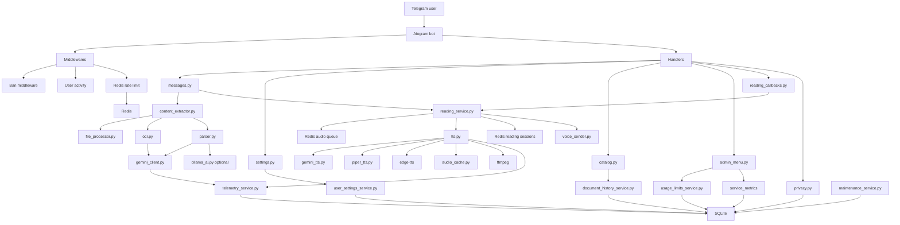

# UTOS Audio Assistant Bot

Telegram-бот для перетворення тексту, документів, фотографій з текстом і веб-статей у голосові повідомлення.

Проєкт орієнтований на доступність: користувач надсилає матеріал, бот витягує текст, за потреби розбиває його на частини, озвучує та надсилає результат у форматі Telegram voice.

## Можливості

- Озвучення звичайного тексту.
- Читання PDF, DOCX і TXT документів.
- Розпізнавання тексту з фотографій через Gemini OCR.
- Витягування основного тексту зі статей за посиланням.
- Генерація короткого змісту великих матеріалів.
- Каталог історії документів з пагінацією.
- Privacy-команди `/privacy` і `/delete_my_data`, retention-очищення історії документів.
- Налаштування голосу та швидкості.
- Ліміти використання для звичайних користувачів і режим `Ліміт+`.
- Адмін-меню зі статистикою, користувачами, баном, видачею `Ліміт+` і редагуванням лімітів.
- Адмін-статистика помилок, latency і оцінки витрат для TTS/Gemini/фотографій.
- Захист від спаму через rate limit.
- Docker-запуск із Redis для rate limit, reading sessions, audio queue і metrics stream.

## Поточна логіка AI/OCR/TTS

### AI parsing

Основний AI-провайдер для парсингу і коротких змістів: Gemini.

Gemini-запити мають quota-aware fallback за моделями. Якщо основна модель повертає `429 RESOURCE_EXHAUSTED`, бот пробує наступну сумісну модель із ланцюжка:

```env
GEMINI_TEXT_MODEL=gemini-3.1-flash-lite
GEMINI_TEXT_MODEL_CHAIN=gemini-2.5-flash,gemini-3-flash-preview,gemini-2.5-flash-lite
```

У коді залишена опційна підтримка Ollama, але за замовчуванням вона вимкнена, бо локальна модель відповідала повільніше та гірше для поточного сценарію.

### OCR

OCR працює тільки через Gemini.

Для фотографій використовується такий самий принцип fallback:

```env
GEMINI_OCR_MODEL=gemini-3.1-flash-lite
GEMINI_OCR_MODEL_CHAIN=gemini-2.5-flash,gemini-3-flash-preview,gemini-2.5-flash-lite
```

Tesseract і PaddleOCR були протестовані та прибрані:

- Tesseract працював некоректно для українських фотографій.
- PaddleOCR був кращий за Tesseract, але помітно гірший за Gemini і додавав велику вагу Docker-образу.

### TTS

Поточний пріоритет озвучки:

- Для звичайних користувачів: `Edge`.
- Для `Ліміт+`: `Gemini -> Edge`.

Gemini TTS підтримує вибір жіночого та чоловічого голосу на основі вибраного користувачем голосу.
Для стабільності на великих матеріалах Gemini TTS використовує менші внутрішні фрагменти тексту, ніж Edge/Piper: за замовчуванням до `1600` символів на audio-запит. Для audio-запитів також є окремий timeout `120` секунд, щоб довша озвучка не падала через глобальний Gemini timeout для OCR/AI. Це зменшує ризик timeout, порожнього audio payload і drift у довгих відповідях preview-моделей.

Для Gemini TTS fallback окремий, бо TTS підтримують тільки audio-generation моделі:

```env
GEMINI_TTS_MODEL=gemini-3.1-flash-tts-preview
GEMINI_TTS_MODEL_CHAIN=gemini-2.5-flash-preview-tts
GEMINI_TTS_REQUEST_TIMEOUT_SECONDS=120
GEMINI_TTS_CHUNK_MAX_LENGTH=1600
```

## Стабільність зовнішніх API

Усі Gemini-запити централізовані в `services/gemini_client.py`.

Wrapper додає:

- timeout на запит;
- retry budget;
- exponential backoff;
- логування latency;
- неблокуючий запис latency, помилок і орієнтовної вартості в адмін-статистику через telemetry queue;
- єдину точку для Gemini OCR, Gemini TTS і AI parser.

Основні налаштування:

```env
GEMINI_REQUEST_TIMEOUT_SECONDS=45
GEMINI_TTS_REQUEST_TIMEOUT_SECONDS=120
GEMINI_RETRY_ATTEMPTS=2
GEMINI_RETRY_BASE_DELAY_SECONDS=1.0
GEMINI_RETRY_MAX_DELAY_SECONDS=6.0
GEMINI_ESTIMATED_INPUT_COST_PER_1K_CHARS_USD=0.0
GEMINI_ESTIMATED_OUTPUT_COST_PER_1K_CHARS_USD=0.0
TTS_ESTIMATED_COST_PER_1K_CHARS_USD=0.0
```

Поля estimated cost за замовчуванням дорівнюють `0.0`, бо тарифи залежать від провайдера та моделі. Якщо потрібно бачити приблизні витрати в адмін-меню, задайте власну ціну за 1000 символів.

## Контроль ресурсів

### Audio cache

Згенеровані voice-файли кешуються у `data/audio_cache`, щоб не генерувати однакові chunks повторно.

Кеш має обмеження:

```env
AUDIO_CACHE_ENABLED=1
AUDIO_CACHE_DIR=data/audio_cache
AUDIO_CACHE_MAX_SIZE_MB=1024
AUDIO_CACHE_MAX_AGE_DAYS=30
AUDIO_CACHE_CLEANUP_INTERVAL_SECONDS=3600
```

Cleanup видаляє старі файли та утримує кеш у межах заданого розміру. Cache hit оновлює час доступу до файлу, тому cleanup поводиться як LRU.

### Rate limit

У Docker використовується Redis-backed rate limit. Якщо Redis недоступний, middleware переходить на in-memory fallback.

```env
RATE_LIMIT_BACKEND=redis
RATE_LIMIT_MAX_EVENTS=8
RATE_LIMIT_PERIOD_SECONDS=10
RATE_LIMIT_WARNING_COOLDOWN_SECONDS=10
```

### Reading sessions і audio queue

Поточні reading-сесії зберігаються в Redis, а не тільки в пам'яті процесу. Це дозволяє переживати restart бота без миттєвої втрати активного стану сесії та готує проєкт до запуску кількох bot replicas.

Генерація audio для поточної частини ставиться в Redis-backed queue, тому Telegram handler швидко відпускає користувацький lock, а бот показує статус черги та прогрес внутрішніх audio-фрагментів. Якщо попередній матеріал користувача ще очікує або генерується, новий матеріал не замінює активну сесію, щоб queued job не ставав stale.

Черга має обмеження розміру. Якщо вона заповнена, бот відповідає текстом і не ставить новий job у fallback memory queue.

Для наступної частини зберігається prefetch, тож кнопка "Слухати далі" часто отримує вже готове audio.
Якщо одна reading-частина розбивається на кілька voice-файлів, кожен файл має власний підпис на кшталт `📄 Частина 1 з 2 · аудіо 1 з 2`, а навігаційне меню лишається тільки на останньому voice-файлі.
Для `Ліміт+` доступний export повної озвучки в один файл: бот генерує всі частини у фоновій черзі, об'єднує їх через ffmpeg і за потреби застосовує smooth merge з нормалізацією гучності та коротким crossfade між сегментами.

```env
READING_SESSION_TTL_SECONDS=2700
READING_SESSION_BACKEND=redis
READING_AUDIO_QUEUE_BACKEND=redis
READING_AUDIO_QUEUE_REDIS_KEY=reading:audio:queue
READING_AUDIO_QUEUE_MAX_SIZE=20
EXPORT_AUDIO_MAX_SIZE_MB=48
EXPORT_AUDIO_SMOOTH_MERGE_ENABLED=1
EXPORT_AUDIO_CROSSFADE_MS=120
```

Поточна Redis queue використовує простий list-based pattern. Якщо потрібна сильніша гарантія доставки jobs після crash worker-а, наступний крок — Redis Streams consumer groups з `XACK`, reclaim pending jobs і dedupe/job-state ключами.

### Privacy і retention

Бот має короткий privacy-текст у команді `/privacy` і команду `/delete_my_data`.

`/delete_my_data` очищає:

- історію документів користувача;
- денні лічильники використання;
- персональні налаштування голосу, швидкості та TTS-провайдера.

Адмін-статус, бан або `Ліміт+` не скидаються цією командою, щоб не ламати модерацію та доступ.

Історія документів і технічні метрики очищаються фоновим maintenance worker:

```env
DOCUMENT_HISTORY_RETENTION_DAYS=90
SERVICE_METRICS_RETENTION_DAYS=30
MAINTENANCE_CLEANUP_INTERVAL_SECONDS=86400
```

## Архітектура



## Структура проєкту

```text
bot.py                         # запуск бота, middleware, router-и, shutdown cleanup
config.py                      # env-конфіг і валідація
.env.example                   # безпечний шаблон конфігурації без секретів
database/db.py                 # SQLite schema, migrations, CRUD
handlers/                      # Telegram handlers
keyboards/                     # inline/reply клавіатури
middlewares/                   # ban, activity, rate limit
services/                      # бізнес-логіка, AI, OCR, TTS, cache, Redis
texts/                         # тексти UI
utils/                         # splitter, audio helpers
tests/                         # pytest coverage
Dockerfile
docker-compose.yml
```

## SQLite чи PostgreSQL

На поточному етапі переходити з SQLite на PostgreSQL не обов'язково.

SQLite зараз підходить, тому що:

- бот працює як один основний process;
- дані прості: users, settings, usage counters, document history;
- увімкнено WAL і busy timeout;
- ліміти використання списуються атомарно через `BEGIN IMMEDIATE`;
- Redis уже закриває rate limit і частину runtime-навантаження.

PostgreSQL має сенс додавати, якщо з'явиться хоча б одна з умов:

- кілька bot replicas або горизонтальне масштабування;
- часті конкурентні записи від великої кількості користувачів;
- потрібні складні аналітичні запити, dashboard-и або audit log;
- потрібні транзакції між кількома сутностями зі складними зв'язками;
- потрібен managed backup/restore і нормальна production-експлуатація БД.

Рекомендація: поки лишити SQLite. Якщо бот почне активно рости, спочатку варто винести database layer за repository interface, а вже потім додавати PostgreSQL. Прямий перехід зараз додасть складність без очевидної користі.

## Запуск через Docker

1. Скопіювати `.env.example` у `.env`.
2. Заповнити мінімальні змінні:

```env
BOT_TOKEN=your_telegram_bot_token
GEMINI_API_KEY=your_gemini_api_key
ADMIN_IDS=123456789

AI_PROVIDER_CHAIN=gemini
GEMINI_TEXT_MODEL=gemini-3.1-flash-lite
GEMINI_TEXT_MODEL_CHAIN=gemini-2.5-flash,gemini-3-flash-preview,gemini-2.5-flash-lite
GEMINI_OCR_MODEL=gemini-3.1-flash-lite
GEMINI_OCR_MODEL_CHAIN=gemini-2.5-flash,gemini-3-flash-preview,gemini-2.5-flash-lite

TTS_PROVIDER=edge
TTS_PROVIDER_CHAIN=edge
GEMINI_TTS_MODEL=gemini-3.1-flash-tts-preview
GEMINI_TTS_MODEL_CHAIN=gemini-2.5-flash-preview-tts
GEMINI_TTS_REQUEST_TIMEOUT_SECONDS=120
GEMINI_TTS_CHUNK_MAX_LENGTH=1600

RATE_LIMIT_BACKEND=redis
READING_SESSION_BACKEND=redis
READING_AUDIO_QUEUE_BACKEND=redis
READING_AUDIO_QUEUE_MAX_SIZE=20
```

3. Запустити:

```powershell
docker compose up --build
```

Дані бота зберігаються у `./data`.

`.env.example` потрібен як безпечний шаблон конфігурації: він показує всі доступні змінні без реальних токенів, допомагає швидко підняти проєкт після клонування і зменшує ризик випадково закомітити секрети з `.env`.

## Локальний запуск

```powershell
python -m venv .venv
.\.venv\Scripts\Activate.ps1
pip install -r requirements.txt
python bot.py
```

Piper лишається технічно доступним у коді, але не використовується у користувацькому меню за замовчуванням.

## Тести

```powershell
.\.venv\Scripts\python.exe -m pytest
```

Поточний стан після останньої перевірки:

```text
234 passed, 1 warning
```

Warning походить із залежності `google-genai` і не є помилкою проєкту.

## Адмін-функції

Адмін визначається через `ADMIN_IDS`.

Підтримується:

- перегляд статистики;
- сторінки користувачів;
- бан і розбан;
- видача `Ліміт+` на 30 днів або безстроково;
- відкликання `Ліміт+`;
- редагування денних лімітів;
- broadcast через старі admin-команди.

## Важливі operational notes

- Не комітити `.env`, бази даних, `data/`, кеші та voice-моделі.
- Для production краще запускати через Docker Compose.
- Якщо Gemini OCR/AI починає давати timeout, спочатку зменшити навантаження або збільшити `GEMINI_REQUEST_TIMEOUT_SECONDS`.
- Якщо саме Gemini TTS падає на довгій озвучці, збільшити `GEMINI_TTS_REQUEST_TIMEOUT_SECONDS` або зменшити `GEMINI_TTS_CHUNK_MAX_LENGTH`.
- Якщо диск росте, перевірити `AUDIO_CACHE_MAX_SIZE_MB` і `AUDIO_CACHE_MAX_AGE_DAYS`.
- Якщо користувачі спамлять sticker/unsupported content, middleware rate limit уже обмежує частоту, а handler не відповідає на кожне unsupported-повідомлення.

## Поточний технічний стан

Проєкт готовий до невеликого production-навантаження.

Найближчі необов'язкові покращення:

- розбити великі файли `services/parser.py`, `database/db.py`, `handlers/admin_menu.py`;
- за потреби додати окремий dashboard для метрик замість перегляду тільки в Telegram.

Це не блокери. Основні проблеми стабільності зовнішніх API та контролю ресурсів уже закриті.