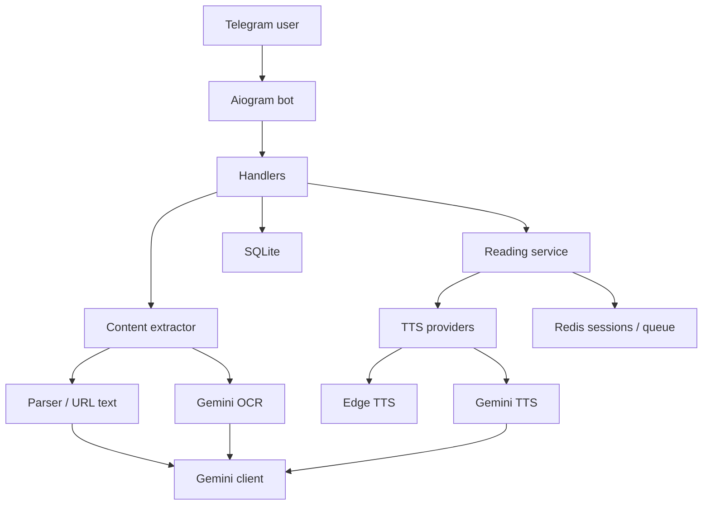

# UTOS Audio Assistant Bot

Telegram-бот, який перетворює текст, документи, фото з текстом і веб-статті на голосові повідомлення.

Проєкт створений як аудіо-помічник для швидкого прослуховування матеріалів: користувач надсилає текст або файл, бот витягує вміст, за потреби ділить його на частини, генерує озвучку і надсилає результат у форматі Telegram voice.

## Що Реалізовано

- Озвучення звичайного тексту.
- Читання PDF, DOCX і TXT файлів.
- Розпізнавання тексту з фото через Gemini OCR.
- Витягування основного тексту зі статей за посиланням.
- Короткий зміст великих матеріалів.
- Каталог документів із можливістю повторно відкрити матеріал.
- Налаштування голосу та швидкості.
- Денна статистика використання для користувача.
- Ліміти для звичайних користувачів і режим `Ліміт+`.
- Адмін-меню зі статистикою, користувачами, баном, `Ліміт+` і редагуванням лімітів.
- Privacy-команди для очищення каталогу або персональних даних.
- Docker-запуск із Redis, SQLite, health API і фоновими чергами озвучки.

## Технології

- Python `3.14.4`.
- `aiogram` для Telegram Bot API.
- Google Gemini API для OCR, короткого змісту, AI-парсингу та Gemini TTS.
- Edge TTS як основний provider озвучення.
- SQLite для користувачів, налаштувань, лімітів, історії документів і метрик.
- Redis для rate limit, reading sessions, черги озвучки та опціонального metrics stream.
- FastAPI/Uvicorn для health/debug API і webhook endpoint.
- Docker Compose для production-like запуску.
- `pytest` і `pytest-asyncio` для тестів.
- `ffmpeg` для об'єднання аудіофайлів.
- PyMuPDF, python-docx, Pillow, BeautifulSoup і aiohttp для обробки файлів, фото та веб-статей.

## Підтримувані матеріали

Бот приймає:

- звичайний текст;
- PDF;
- DOCX;
- TXT;
- фото з текстом;
- посилання на статтю або новину.

Якщо матеріал великий, бот розбиває його на частини. Після кожної частини користувач може перейти далі, отримати короткий зміст або завершити читання.

## Мови

Бот автоматично визначає мову тексту.

Для прямого добору TTS-голосу підтримуються:

- українська;
- англійська;
- німецька;
- польська;
- словацька;
- чеська.

Gemini може обробляти й інші мови для OCR, парсингу та короткого змісту, але для озвучення бот використає найближчий доступний fallback-голос.

## Демонстрація Та Запуск

Для перегляду або демонстрації проєкту спочатку зв'яжіться з автором проєкту. Бот потребує налаштованих секретів (`BOT_TOKEN`, `GEMINI_API_KEY`) і прив'язаний до конкретного Telegram-бота, тому найзручніше показувати його через готовий налаштований екземпляр.

Самостійний запуск також можливий через Docker Compose за інструкцією нижче.

## Самостійний Запуск Через Docker

Найпростіший спосіб запуску — Docker Compose.

1. Створіть Telegram-бота через [BotFather](https://t.me/BotFather) і отримайте `BOT_TOKEN`.
2. Створіть Gemini API key у [Google AI Studio](https://aistudio.google.com/app/apikey).
3. Скопіюйте `.env.example` у `.env`.
4. Заповніть мінімальні змінні:

```env
BOT_TOKEN=your_telegram_bot_token
GEMINI_API_KEY=your_gemini_api_key
ADMIN_IDS=123456789
```

5. Запустіть проєкт:

```powershell
docker compose up --build
```

Дані бота зберігаються у `./data`. Redis піднімається окремим сервісом у Docker Compose.

## Основні Env-Змінні

Повний список доступних налаштувань дивіться в `.env.example`. Для старту зазвичай достатньо змін нижче.

| Змінна | Обов'язкова | Для чого |
| --- | --- | --- |
| `BOT_TOKEN` | Так | Telegram token від BotFather. |
| `GEMINI_API_KEY` | Так | API key для Gemini OCR, summary і Gemini TTS. |
| `ADMIN_IDS` | Так | Telegram user ID адміністраторів через кому. |
| `DB_PATH` | Ні | Шлях до SQLite бази. У Docker краще `/app/data/bot_database.sqlite`. |
| `REDIS_URL` | Ні | Redis для rate limit, reading sessions, audio queue і metrics stream. |
| `TTS_PROVIDER` | Ні | Основний TTS provider. За замовчуванням `edge`. |
| `TTS_PROVIDER_CHAIN` | Ні | Fallback-ланцюжок TTS. За замовчуванням `edge`. |
| `READING_SESSION_BACKEND` | Ні | Де зберігати активні reading-сесії: `memory` або `redis`. |
| `READING_AUDIO_QUEUE_BACKEND` | Ні | Черга генерації озвучки: `memory` або `redis`. |
| `API_ENABLED` | Ні | Вмикає lightweight API поруч із polling-ботом. |
| `API_AUTH_TOKEN` | Рекомендовано | Bearer token для `/metrics` і `/admin/stats`. |
| `LOG_FORMAT` | Ні | `text` для локального читання або `json` для log collectors. |

Для Docker Compose рекомендовано:

```env
DB_PATH=/app/data/bot_database.sqlite
REDIS_URL=redis://redis:6379/0
RATE_LIMIT_BACKEND=redis
READING_SESSION_BACKEND=redis
READING_AUDIO_QUEUE_BACKEND=redis
API_ENABLED=1
API_HOST=0.0.0.0
API_PORT=8080
API_HOST_PORT=8081
```

## Як Користуватися

1. Надішліть текст, файл, фото або посилання.
2. Бот витягне текст і почне озвучення.
3. Якщо матеріал великий, бот надішле його частинами.
4. Через кнопки можна слухати наступну частину, створити короткий зміст або завершити роботу з матеріалом.
5. У каталозі можна відкрити нещодавні документи повторно.

## Команди

Команди для звичайних користувачів:

| Команда | Опис |
| --- | --- |
| `/start` | Почати роботу. |
| `/help` | Показати довідку. |
| `/settings` | Налаштувати голос і швидкість. |
| `/catalog` | Відкрити каталог документів. |
| `/catalog_clear` | Очистити каталог документів. |
| `/usage` | Показати статистику використання. |
| `/privacy` | Показати політику конфіденційності. |
| `/delete_my_data` | Очистити історію документів і персональні дані. |

Адміністратори додатково мають доступ до адмін-меню, статистики, керування користувачами, банів, `Ліміт+` і денних лімітів.

## API Та Health Checks

У Docker Compose API доступний на `http://localhost:8081`, якщо `API_ENABLED=1`.

Доступні endpoint-и:

| Endpoint | Призначення |
| --- | --- |
| `GET /health` | Liveness-перевірка процесу. |
| `GET /ready` | Readiness-перевірка SQLite/Redis. |
| `GET /version` | Версія сервісу. |
| `GET /metrics?days=1` | Технічні service metrics. |
| `GET /admin/stats?date=YYYY-MM-DD` | Агрегована адмін-статистика. |
| `POST /webhook/telegram` | Telegram webhook endpoint для `BOT_RUNTIME_MODE=webhook`. |

`/metrics` і `/admin/stats` підтримують Bearer-захист через `API_AUTH_TOKEN`.

Важливо: якщо `API_AUTH_TOKEN` порожній, ці endpoint-и відкриті. Не публікуйте API назовні без токена або іншого мережевого захисту.

## Архітектура

Коротко про runtime:

- `aiogram` приймає Telegram update-и.
- Handlers обробляють команди, повідомлення, каталог, налаштування, privacy і адмін-дії.
- `content_extractor` витягує текст із повідомлень, файлів, фото або URL.
- Gemini використовується для OCR, короткого змісту і частини TTS-сценаріїв.
- Edge TTS є основним provider-ом озвучення.
- SQLite зберігає користувачів, налаштування, ліміти, історію документів і метрики.
- Redis використовується для rate limit, reading sessions, черги озвучки і опціонального metrics stream.
- `reading_service` координує reading-сесії, генерацію аудіо, prefetch наступної частини і export повної озвучки.



## Структура Проєкту

```text
bot.py                         # запуск бота, router-и, middleware, shutdown cleanup
config.py                      # env-конфіг і валідація
database/db.py                 # SQLite schema, migrations, CRUD
handlers/                      # Telegram handlers
keyboards/                     # inline/reply клавіатури
middlewares/                   # ban, activity, rate limit
services/                      # бізнес-логіка, AI, OCR, TTS, Redis, cache
texts/                         # тексти UI
utils/                         # splitter, audio helpers
tests/                         # unit/smoke/API tests
integration_tests/             # Redis integration tests
Dockerfile
docker-compose.yml
.env.example                   # безпечний шаблон конфігурації без секретів
```

## Локальний Запуск Для Розробки

Потрібні Python `3.14.4` і `ffmpeg`.

```powershell
python -m venv .venv
.\.venv\Scripts\Activate.ps1
pip install -r requirements.txt -r requirements-dev.txt
python bot.py
```

Для локального запуску без Docker Redis можна не піднімати, якщо залишити memory-backend-и у `.env`. Для production рекомендований Docker Compose із Redis.

## Тести

Основний тестовий набір:

```powershell
.\.venv\Scripts\python.exe -m pytest
```

Поточний стан після останньої перевірки:

```text
275 passed, 1 warning
```

Redis integration-тести запускаються окремо:

```powershell
.\.venv\Scripts\python.exe -m pytest integration_tests -q
```

Локально вони skip-яться, якщо Redis не запущений на `TEST_REDIS_URL`. У GitHub CI Redis піднімається як service.

## Privacy Та Дані

Бот зберігає:

- Telegram user ID, ім'я та username;
- користувацькі налаштування голосу і швидкості;
- денні лічильники використання для лімітів і anti-abuse захисту;
- історію документів для каталогу;
- технічні метрики роботи сервісів.

Команда `/catalog_clear` очищає каталог документів. Команда `/delete_my_data` після підтвердження очищає історію документів, персональні налаштування, активну reading-сесію, задачі озвучки користувача в черзі та audio cache.

Денні лічильники використання, адмін-статус, бан або `Ліміт+` не скидаються через `/delete_my_data`, щоб не можна було обходити ліміти, модерацію і контроль доступу.

## Security Notes

- Не комітьте `.env`, бази даних, `data/`, кеші та voice-моделі.
- Для production задайте `API_AUTH_TOKEN`, якщо API доступний не тільки всередині Docker/локальної мережі.
- Зберігайте `BOT_TOKEN` і `GEMINI_API_KEY` тільки локально або в secret manager.
- Для production краще запускати через Docker Compose.

## License

Проєкт поширюється під ліцензією GNU Affero General Public License v3.0. Дивіться [LICENSE](LICENSE).
